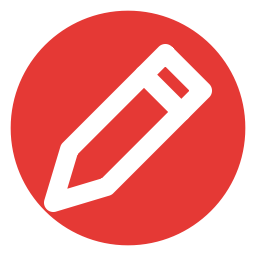
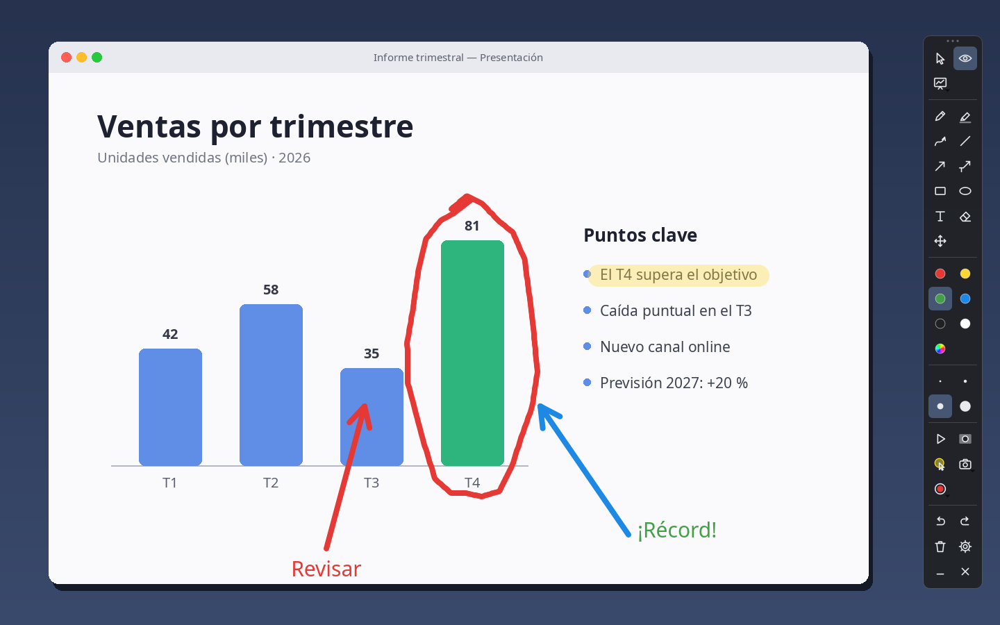
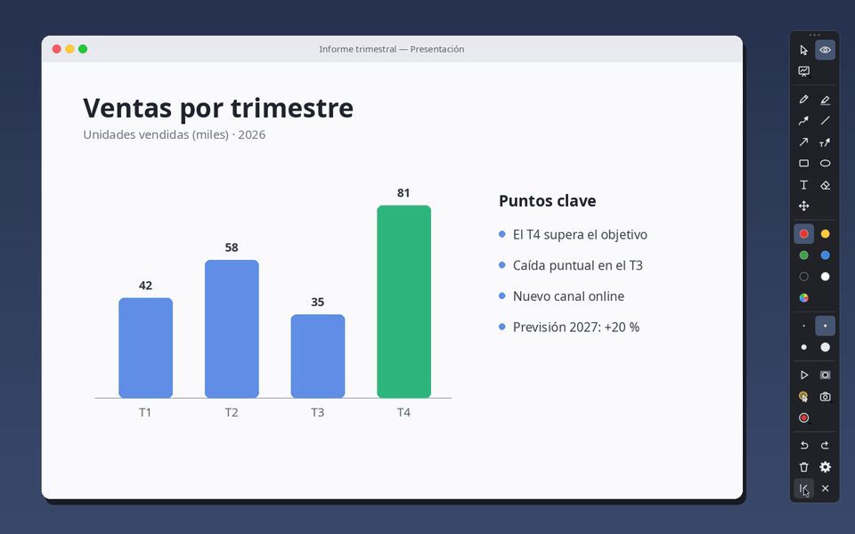
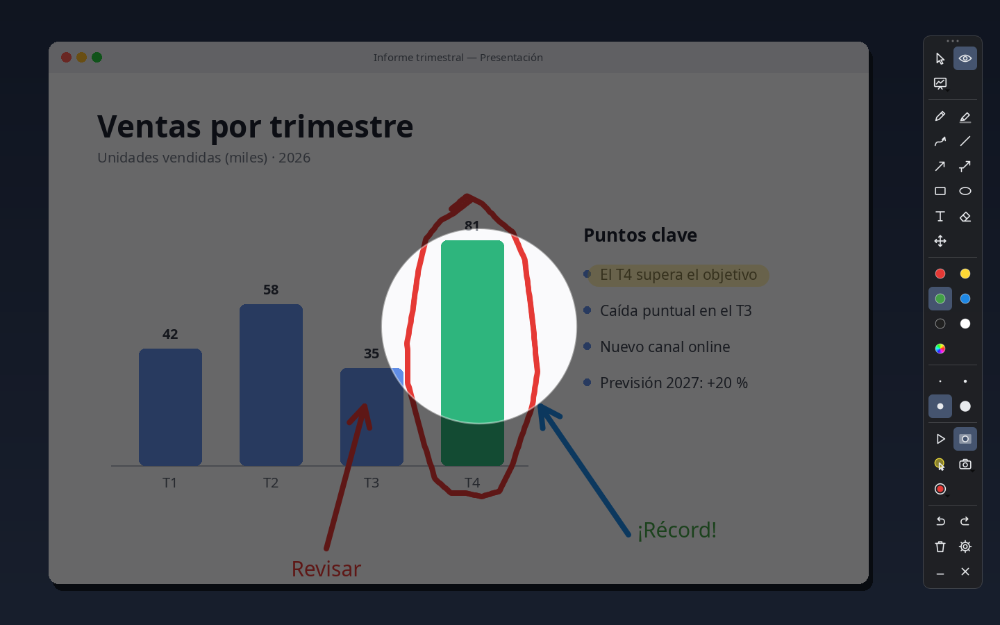
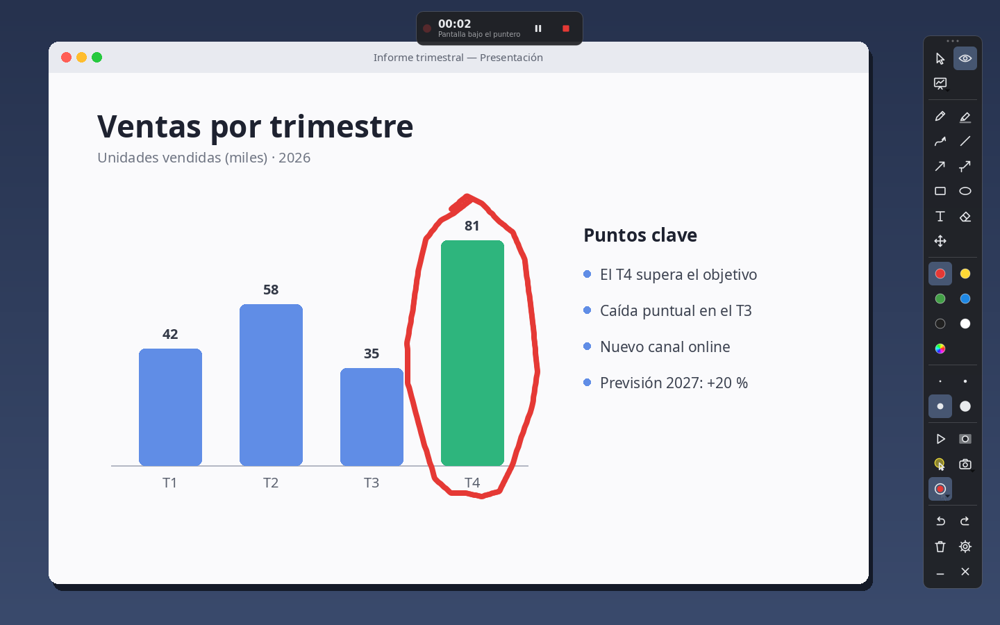
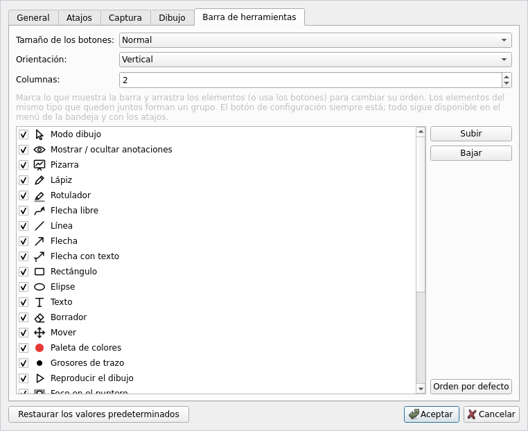

<div align="center">



# Recrayon

**Dibuja sobre la pantalla sin dejar de usarla.**

Anota encima de cualquier aplicación, en todos tus monitores, y vuelve a trabajar con un clic.
Pensado para presentaciones, clases, demos en vivo y grabaciones de pantalla.

[](CHANGELOG.md)
[](#descargar)
[](LICENSE)
[](https://www.qt.io/)
[](#compilar)

[**Descargar**](../../releases/latest) · [Funcionalidades](#funcionalidades) ·
[Atajos](#atajos) · [Compilar](#compilar) · [Licencia](#licencia)

<br>


</div>

## ¿Cómo funciona?

Recrayon coloca una capa transparente sobre cada monitor y alterna entre dos modos:

| Modo | Qué pasa |
|------|----------|
| **Dibujo** | La capa recoge el ratón: dibujas trazos, flechas, formas y texto. |
| **Interacción** | Los dibujos siguen visibles, pero los clics pasan a las aplicaciones de debajo. |

Cambias de modo con la toolbar, con un atajo global (`Ctrl+Alt+Shift+D`) o desde el icono de la
bandeja. `Esc` siempre te devuelve a tus aplicaciones.

## Funcionalidades

### Anota encima de cualquier cosa

Lápiz, rotulador translúcido, flecha libre, línea, flecha, **flecha con texto**, rectángulo,
elipse, **texto**, borrador y mover. 6 colores configurables más un selector libre, 4 grosores y
deshacer / rehacer ilimitado.



### Pizarra y reproducción

La **pizarra** abre una página en blanco en una pantalla o en todas, sin perder lo que habías
dibujado en el escritorio. **Reproducir** vuelve a dibujar toda la explicación desde cero, en el
orden en que se hizo: los trazos avanzan, las formas se trazan y el texto se teclea. Ideal para
grabarlo en vídeo.



### Dirige la atención

El **foco** oscurece todo menos la zona del puntero; el **halo** lo resalta en amarillo. Útil en
directo y en grabaciones.



### Capturas y grabación

- **Capturas** del monitor bajo el ratón, de todos los monitores en una imagen o de un
  **recuadro / ventana**; se guardan y se copian al portapapeles.
- **Vídeo** MP4 del monitor, **siguiendo al cursor** entre pantallas, de todos los monitores
  (en uno o varios vídeos) o de un recuadro / ventana, con **micrófono** opcional y tres niveles
  de calidad.
- Un indicador muestra el tiempo y permite **pausar** y **parar**. En Windows, ni la toolbar ni
  el indicador aparecen en las capturas ni en los vídeos.



### Una toolbar a tu medida

Elige qué botones muestra y en qué orden, su tamaño, si es vertical u horizontal y cuántas
columnas o filas tiene. Recuerda su posición, el grosor y la herramienta entre sesiones. Se puede
**minimizar**: Recrayon sigue en segundo plano y vuelve desde la barra de tareas o el icono de la
bandeja.


<p align="center">
  
</p>

<details>
<summary><b>Lista completa de funcionalidades</b></summary>

- Overlay por monitor, con soporte para conectar y desconectar pantallas en caliente y DPI mixto.
- **Flecha con texto**: al soltar la flecha escribes una etiqueta en su origen.
- **Pizarra** con color configurable, en la pantalla del cursor o en todas (Configuración, o clic
  derecho en su botón). Deshacer y rehacer siguen a la página activa.
- **Reproducir** (`Ctrl+Alt+Shift+Espacio` o botón ▶) con velocidad lenta, normal o rápida;
  `Esc` la detiene.
- **Volver al ratón** tras colocar un elemento, configurable por herramienta (por ejemplo, flecha
  y texto).
- Cada modo que captura el ratón o el teclado (dibujo, pizarra, texto, selector de área) indica
  arriba cómo salir. Estos avisos no salen en capturas ni vídeos.
- Selector de área: arrastra un recuadro (puede cruzar pantallas), haz clic en una ventana (se
  resalta al pasar por encima) o en el escritorio para la pantalla entera.
- Botones de captura y grabación: clic = destino por defecto; clic derecho = elegir destino o
  **abrir la carpeta** donde se guardan (`Imágenes\Recrayon`, `Vídeos\Recrayon` o la que elijas).
- Grabación MP4/H.264 a 30 fps, calidad *Máxima*, *Alta* o *Compacta*; el tiempo en pausa no
  entra en el vídeo; la ventana grabada se sigue si se mueve.
- **Cursor del ratón** en capturas y vídeos, opcional.
- **Configuración**: idioma, atajos globales, destinos y carpetas, calidad de vídeo y micrófono,
  fuente y tamaño del texto, paleta, color inicial, color de la pizarra, velocidad de
  reproducción, "volver al ratón" y toolbar (elementos, orden, tamaño, orientación, columnas).
- Herramientas de la toolbar: clic para dibujar; otro clic en la misma para volver al ratón.
- Atajos globales en Windows: funcionan aunque otra aplicación tenga el foco.
- En español e inglés: sigue el idioma del sistema o el que elijas.

</details>

## Descargar

Descarga el instalador de tu sistema desde la [**última versión**](../../releases/latest):

| Sistema | Archivo | Instalación |
|---------|---------|-------------|
| **Windows** 10 (1809+) / 11 | `Recrayon-<versión>-setup.exe` | Ejecútalo. Se instala para tu usuario, sin permisos de administrador; se desinstala desde *Configuración → Aplicaciones*. |
| **Debian / Ubuntu** | `recrayon_<versión>_amd64.deb` | `sudo apt install ./recrayon_<versión>_amd64.deb`. Queda en el menú de aplicaciones. |
| **Cualquier Linux** x86-64 | `Recrayon-<versión>-x86_64.AppImage` | `chmod +x Recrayon-*.AppImage` y ejecútalo (necesita `libfuse2`). |
| **macOS** 12+ (Apple Silicon e Intel) | `Recrayon-<versión>-macOS.dmg` | Arrastra Recrayon a *Aplicaciones*. La primera vez: clic derecho → *Abrir*. |

**Actualizar**: instala la versión nueva encima. En Windows el instalador detecta la versión
instalada y pregunta antes de actualizar; tus ajustes se conservan siempre.

> [!NOTE]
> Los instaladores aún no están firmados: Windows puede mostrar el aviso de SmartScreen
> (*Más información → Ejecutar de todas formas*) y macOS pide abrir la app con clic derecho la
> primera vez. En Linux se necesita una sesión X11 o XWayland; los paquetes incluyen su propio Qt
> y funcionan en Ubuntu 22.04+, Debian 12+ y equivalentes.

## Atajos

Los atajos globales se cambian en **Configuración**. Valores por defecto:

| Acción                            | Atajo                    | Dónde                    |
|-----------------------------------|--------------------------|--------------------------|
| Activar / desactivar dibujo       | `Ctrl+Alt+Shift+D`       | Global (Windows)         |
| Mostrar / ocultar anotaciones     | `Ctrl+Alt+Shift+H`       | Global (Windows)         |
| Pizarra                           | `Ctrl+Alt+Shift+W`       | Global (Windows)         |
| Reproducir el dibujo              | `Ctrl+Alt+Shift+Espacio` | Global (Windows)         |
| Borrar todo                       | `Ctrl+Alt+Shift+C`       | Global (Windows)         |
| Foco en el puntero                | `Ctrl+Alt+Shift+F`       | Global (Windows)         |
| Halo en el puntero                | `Ctrl+Alt+Shift+P`       | Global (Windows)         |
| Captura (destino por defecto)     | `Ctrl+Alt+Shift+S`       | Global (Windows)         |
| Captura de recuadro o ventana     | `Ctrl+Alt+Shift+A`       | Global (Windows)         |
| Iniciar / parar grabación         | `Ctrl+Alt+Shift+R`       | Global (Windows)         |
| Grabar recuadro o ventana         | `Ctrl+Alt+Shift+V`       | Global (Windows)         |
| Salir del modo dibujo             | `Esc`                    | Modo dibujo              |
| Elegir herramienta                | `1`…`9`, `0`, `M`        | Modo dibujo              |
| Deshacer / rehacer                | `Ctrl+Z` / `Ctrl+Y`      | Modo dibujo              |
| Confirmar texto / salto de línea  | `Enter` / `Shift+Enter`  | Escribiendo texto        |

En Linux y macOS los atajos globales aún no están disponibles: usa la toolbar o el icono de la
bandeja.

## Compilar

Requisitos: CMake ≥ 3.25, Ninja, un compilador C++20 y Qt ≥ 6.5 (Qt Multimedia 6.8 para grabar).

```sh
cmake --preset release -DCMAKE_PREFIX_PATH=/ruta/a/Qt/6.8.3/<kit>
cmake --build --preset release
ctest --preset release
```

Qt se puede instalar con el [instalador oficial](https://www.qt.io/download-qt-installer) o con
[aqtinstall](https://github.com/miurahr/aqtinstall). Los instaladores de cada sistema se generan
con GitHub Actions (`.github/workflows/release.yml`).

## Licencia

Copyright © 2026 Gonzalo Cordeiro Mourelle.

Recrayon es **código fuente disponible** bajo la licencia
[CC BY-NC-ND 4.0](https://creativecommons.org/licenses/by-nc-nd/4.0/deed.es) ([LICENSE](LICENSE)):

- ✅ Puedes leer el código, usar Recrayon y compartirlo sin cambios, citando al autor.
- ❌ No se permite el uso comercial (venderlo, incluirlo en un producto o servicio de pago…).
- ❌ No se permite distribuir versiones modificadas ni obras derivadas.

No es una licencia *open source* en el sentido de la OSI. No se aceptan contribuciones externas;
para otros usos, contacta con el autor. Los paquetes incluyen Qt y FFmpeg bajo LGPL, con sus
propias licencias ([THIRD-PARTY-NOTICES.md](THIRD-PARTY-NOTICES.md)).
